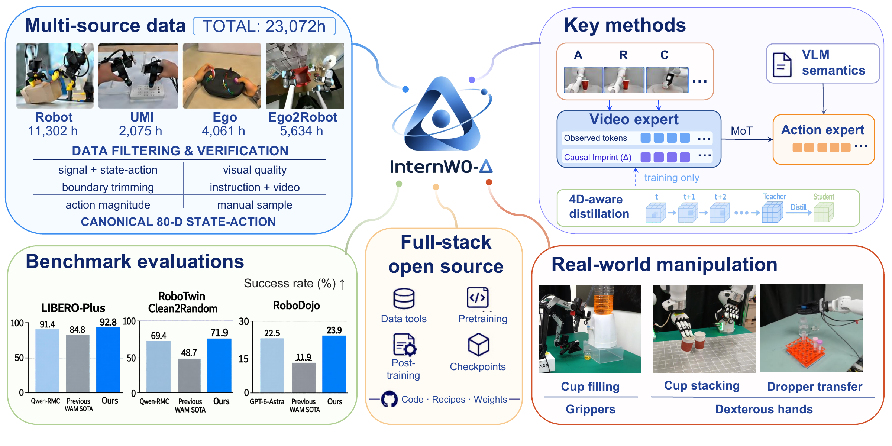
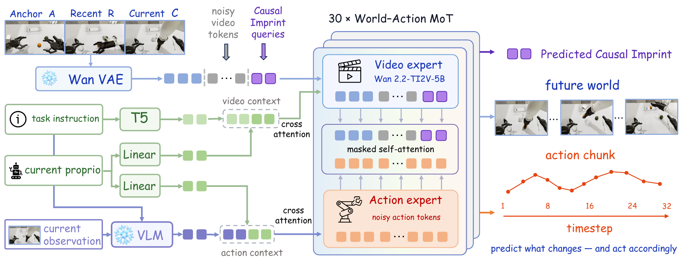

<p align="center">
  
</p>

<p align="center"><strong>A World Action Model Bridging Predictive Dynamics and Actions with 20K+ Hours of Open Data</strong></p>

<p align="center">
  <a href="README.md">English</a> · <b>中文</b><br>
  <a href="#快速开始">🚀 快速开始</a> ·
  <a href="#训练">🔥 训练</a> ·
  <a href="#评测与部署">🦾 评测与部署</a> ·
  <a href="docs/models.md">📦 模型下载</a>
</p>

<p align="center">
  <a href="https://internrobotics.github.io/InternW0-Delta/"><b>🌐 项目主页</b></a> ·
  <a href="https://arxiv.org/abs/2609.31394"><b>📄 论文 / arXiv</b></a> ·
  <b>🤗 Hugging Face</b> (待发布)
</p>

<p align="center">
  
</p>

<a name="方法概览"></a>

## ✨ 方法概览

**InternW0-delta（InternW0-Δ）** 是从机器人与人类示范中学习的统一世界–动作模型。它结合预训练视频动态、冻结的视觉语言模型，以及训练期的 4D 监督，生成机器人动作。

- 🧩 **World–Action MoT。** 预训练视频专家与动作专家通过带掩码的自注意力交互，并结合视觉记忆和任务相关的场景语义。
- 🔮 **Causal Imprint。** 紧凑的查询通过未来监督学习与动作相关的场景变化，为动作专家提供预测性特征。
- 🌌 **4D 蒸馏。** 冻结的 Track4World 教师在训练期传递几何与运动知识，动作推理时无需教师模型或蒸馏分支。

<p align="center">
  
</p>

本仓库提供数据准备、预训练、4D 蒸馏、后训练、评测与真机部署代码。

<a name="快速开始"></a>

## 🚀 快速开始

### 1. 安装

使用 Linux、Python 3.11、CUDA GPU 和 FFmpeg。DeepSpeed 扩展需要 C++ 编译器与匹配的 CUDA toolkit。

```bash
git clone https://github.com/InternRobotics/InternW0-Delta.git
cd InternW0-Delta
python3.11 -m venv .venv
source .venv/bin/activate
python -m pip install --upgrade pip
python -m pip install torch==2.10.0 torchvision==0.25.0 --index-url https://download.pytorch.org/whl/cu128
python -m pip install -e '.[train]'
```

### 2. 准备模型与数据

按照[模型说明](docs/models.md)下载骨干模型与策略权重。后训练的初始化权重放在 `checkpoints/pretrain.pt`。

按照[数据说明](docs/data.md)准备所选数据集。以下命令均在仓库根目录运行。

### 3. 后训练

以 LIBERO 为例：

```bash
export LIBERO_DATA_ROOT=data/libero
python tools/text_cache.py task=libero
NPROC_PER_NODE=8 bash run.sh libero
```

训练后可进行 [LIBERO Plus 评测](eval/libero_plus/README.md)，其他任务入口见下文。

<a name="训练"></a>

## 🔥 训练

### 预训练

通过 [dataset.yaml](configs/pretrain/dataset.yaml) 中的 `source_files` 选择数据集，训练自动读取所选数据源的归一化统计。

准备[动作专家初始权重](docs/models.md#pretraining-initialization)后运行：

```bash
python tools/path_index.py
python tools/pretrain_text_cache.py
NPROC_PER_NODE=8 bash run.sh pretrain
```

添加 `resume=checkpoints/pretrain.pt model.skip_dit_load_from_pretrain=true` 可从预训练权重继续训练，此时无需另行准备动作专家初始权重。自定义数据的统计计算见[归一化说明](docs/data.md#text-cache-and-normalization)。

### 4D 蒸馏

选择数据、缓存 Track4World 教师特征并继续训练，见 [4D 蒸馏指南](tools/4D_distillation/README_zh.md)。

### 任务配置

将任务名用于 `python tools/text_cache.py task=<task>` 和 `bash run.sh <task>`。所需数据格式见[后训练数据说明](docs/data.md#post-training)。

| 任务 | 配置 | 评测 / 部署 |
| --- | --- | --- |
| LIBERO | [`libero`](configs/task/libero.yaml) | [LIBERO Plus](eval/libero_plus/README.md) |
| RoboTwin | [`robotwin`](configs/task/robotwin.yaml) | [RoboTwin](eval/robotwin/README.md) |
| RoboDojo | [`robodojo`](configs/task/robodojo.yaml) | [RoboDojo](eval/robodojo/README_zh.md) |
| Ebench | [`ebench`](configs/task/ebench.yaml), [`ebench_joint_ee`](configs/task/ebench_joint_ee.yaml) | — |
| 真机 / RTC | [`rtc`](configs/task/rtc.yaml) | [部署](deploy/README_zh.md) |

<a name="评测与部署"></a>

## 🦾 评测与部署

下载对应任务的[权重](docs/models.md)，按各指南安装环境并运行：

| 指南 | 用途 |
| --- | --- |
| [LIBERO Plus](eval/libero_plus/README.md) | 在任务扰动下评测 LIBERO 策略 |
| [RoboTwin](eval/robotwin/README.md) | 使用 clean 示范后训练，进行 clean → random 评测 |
| [RoboDojo](eval/robodojo/README_zh.md) | 运行 Isaac Sim 基准评测 |
| [真机部署](deploy/README_zh.md) | RTC 训练、机器人接口、同步与异步执行 |

<a name="infra"></a>

## ⚡ Infra

基于 [LiteGen](https://github.com/DeepLink-org/LiteGen) 的训练优化工作，我们为 InternW0-Δ 提供可选加速方案，包括抽帧解码、VLM 执行优化、VAE/VLM 缓存和 MoT 编译。

```bash
bash run.sh libero +infra=online
bash run.sh robotwin +infra=compile
```

配置选择、缓存生成与 A800 加速参考见 [infra 指南](docs/infra.md)。

<a name="数据与工具"></a>

## 🗂️ 数据与工具

| 指南 | 用途 |
| --- | --- |
| [数据准备](docs/data.md) | 数据集选择、路径索引、文本缓存与归一化 |
| [可视化](tools/visualization/README.md) | 视频、URDF 状态 / 动作回放与同步曲线 |

以下默认路径可通过环境变量或 YAML 修改：

| 变量 | 默认值 |
| --- | --- |
| `WAM_DATA_ROOT` | `data` |
| `WAM_CACHE_ROOT` | `.cache/internw0` |


<a name="80d-状态与动作定义"></a>

## 📐 80D 状态与动作定义

不同机器人形态的数据共用带掩码的 80D 表示。

<details>
<summary><b>查看维度与约定</b></summary>

| 维度（从 0 开始，左闭右开） | 状态 | 动作 |
| --- | --- | --- |
| `[0,7)` / `[40,47)` | 左 / 右臂关节 | 关节目标 |
| `[7,10)` / `[47,50)` | 左 / 右末端位置 | 平移增量 |
| `[10,16)` / `[50,56)` | 末端旋转，6D 表示 | 前 3 维为旋转向量增量，后 3 维屏蔽 |
| `[16,17)` / `[56,57)` | 左 / 右夹爪 | 夹爪指令 |
| `[17,29)` / `[57,69)` | 左 / 右手，各 12 个控制通道 | 手部指令 |
| `[29,34)` | 躯干关节，最多 5 维 | 绝对关节目标 |
| `[34,39)` / `[69,74)` | 预留，屏蔽 | 预留，屏蔽 |
| `[39,40)` | 独立升降高度 | 绝对高度目标 |
| `[74,77)` | 头部关节，最多 3 维 | 绝对关节目标 |
| `[77,80)` | 有效时为底盘 `(x, y, yaw)` | 当前底盘坐标系下的前向、左向、转角位移，每个源数据行的单位为 m / m / rad |

缺失通道填零并屏蔽。手部通道表示独立手指控制量；躯干和头部的关节顺序，以及关节、夹爪、升降的原生单位由数据适配器指定。底盘动作是有限位移而非速度，无有效底盘状态时屏蔽对应状态维度。末端参考系和增量约定见各数据适配器。完整布局见 [robot.yaml](configs/pretrain/projections/robot.yaml)。

</details>

<a name="引用"></a>

## 📚 引用

```bibtex
@misc{miao2026internw0deltaworldactionmodel,
      title={InternW0-$\Delta$: A World Action Model Bridging Predictive Dynamics and Actions with 20K+ Hours of Open Data},
      author={Xingyu Miao and Zizun Li and Baole Fang and Kaiwen Song and Tenghui Wang and Hanxue Zhang and Yating Wang and Xudong Li and Yuping He and Xueyuan Wei and Chao Gao and Xijie Yang and Yingxiang Xu and Kerui Ren and Wenqi Guo and Jianjun Zhou and Xinzhe Wang and Weiguang Zhao and Ni Yang and Zetao Cai and Yufei Xue and Hengjie Li and Zeyu He and Yuanzhen Zhou and Rong Fu and Jianyang Zhang and Siwei Cui and Fuxian Huang and Yunsong Zhou and Xing Gao and Yifei Yao and Qiaojun Yu and Kailin Li and Ming Zhou and Mu Huang and Xinyue Li and Wenze Cui and Bingqi Jiang and Xueyue Zhu and Junting Dong and Haoyu Guo and Tao Lu and Mulin Yu and Bowen Zhou and Bin Zhao and Tianfan Xue and Weinan Zhang and Chunhua Shen},
      year={2026},
      eprint={2609.31394},
      archivePrefix={arXiv},
      primaryClass={cs.RO},
      url={https://arxiv.org/abs/2609.31394},
}
```

<a name="许可证"></a>

## 📜 许可证

代码采用 [MIT License](LICENSE)。第三方组件保留各自许可证，见 [NOTICE](NOTICE)。
